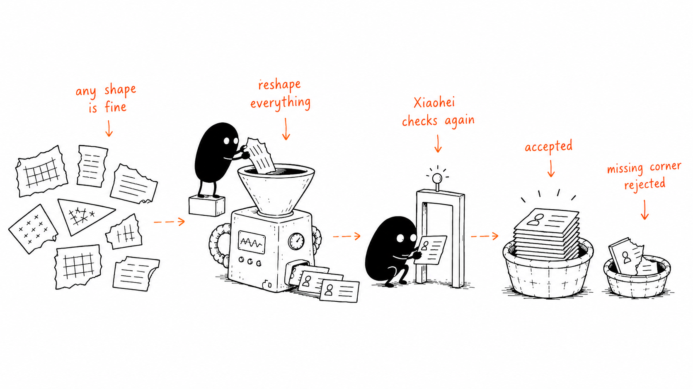

# GrowEasy AI-Powered CSV Importer

> Import leads from **any** CSV shape — Facebook Lead Ads, Google Ads, Excel exports, other
> CRMs, hand-built spreadsheets — into a fixed CRM schema. Column mapping is done by an LLM
> (Google Gemini) with structured output, not by hard-coded header matching.


-black>)




## Table of contents

- [Quick start](#quick-start)
- [Deployment](#deployment)
- [Architecture](#architecture)
- [API reference](#api-reference)
- [Configuration](#configuration)
- [CRM schema & mapping rules](#crm-schema--mapping-rules)
- [Resilience & data integrity](#resilience--data-integrity)
- [Sample data](#sample-data)
- [Development](#development)
- [Testing](#testing)

## Quick start

**Prerequisites:** Node.js ≥ 20.9 and a [Google Gemini API key](https://aistudio.google.com/apikey).

```bash
# Terminal 1 — backend (http://localhost:4000)
cd backend
npm install
cp .env.example .env        # then set GEMINI_API_KEY in .env
npm run dev

# Terminal 2 — frontend (http://localhost:3000)
cd frontend
npm install
cp .env.example .env
npm run dev
```

Or run both with Docker Compose. `docker-compose.yml` reads `${VAR}` substitutions from a
`.env` file at the repo root (**not** `backend/.env` or `frontend/.env` — those are only used
by `npm run dev`):

```bash
cp .env.example .env   # then set GEMINI_API_KEY in .env
docker compose up --build
```

Alternatively, skip the file and pass the key inline for a one-off run:

```bash
GEMINI_API_KEY=your-key-here docker compose up --build
```

Sanity check: `curl http://localhost:4000/health` → `{"status":"ok"}`.

## Deployment

Frontend and backend deploy to separate platforms — the backend is a long-running Express
server (`app.listen`), which is a better fit for a persistent-container host than for Vercel's
serverless functions.

**Backend → Render**, using the `render.yaml` blueprint at the repo root (builds
`backend/Dockerfile`):

1. In Render, "New +" → "Blueprint" → point at this repo. It picks up `render.yaml`
   automatically.
2. Set `GEMINI_API_KEY` (required) and `CORS_ORIGIN` (the frontend's deployed URL, e.g.
   `https://your-app.vercel.app`) in the Render service's environment variables — both are
   marked `sync: false` in the blueprint so they're not committed.
3. Render assigns the container a `PORT` env var automatically; the backend already reads
   `process.env.PORT` (see `backend/src/index.ts`), so no change needed there.
4. Note the resulting service URL (e.g. `https://groweasy-backend.onrender.com`).

**Frontend → Vercel**, as a plain Next.js project rooted at `frontend/`:

1. Import the repo in Vercel, set the project's root directory to `frontend`. Vercel
   auto-detects Next.js — no `vercel.json` needed.
2. Set `NEXT_PUBLIC_API_BASE_URL` to the Render backend's URL from above. This is a build-time
   variable, so set it before the first deploy — or after, followed by a redeploy (saving it
   alone does not rebuild an existing deployment).

Sanity check after both are live: open the Vercel URL, upload a sample CSV, and confirm the
import completes — DevTools → Network should show requests going to the Render URL, not
`localhost`.

## Architecture

```
frontend/ (Next.js)
  Dropzone -> Papaparse -> preview table      (client-side, NO AI call)
  "Confirm Import" --------------------------------+
                                                     |  POST /api/import
                                                     v
backend/ (Express)
  multer (10 MB, CSV only)
    -> csvParser.ts        parse buffer into rows (Papaparse, header trim)
    -> aiExtractor.ts      chunk rows into batches of AI_BATCH_SIZE (20)
                            run <=3 batches concurrently, retry w/ backoff
    -> geminiClient.ts     structured output (responseSchema, temperature 0)
    -> validation.ts       server-side re-check of every AI-returned record
                                                     |
                                                     |  NDJSON stream:
                                                     |  progress event per batch,
                                                     |  then one result/error event
                                                     v
frontend/ (Next.js)
  ProcessingIndicator (progress per batch) -> ResultView (imported / skipped tabs)
```

```
backend/    Express + TypeScript API — CSV parsing, batched AI field-mapping, validation
frontend/   Next.js (App Router) + TypeScript + Tailwind — upload, preview, confirm, results
samples/    Sample CSVs shaped like real-world lead sources, for manual testing docker-compose.yml
```

### Request lifecycle

1. **Upload & preview (no AI cost).** The CSV is parsed client-side with Papaparse and
   rendered in a sticky-header table (virtualized via `@tanstack/react-virtual` past 100
   rows). Nothing touches the backend yet.
2. **Confirm.** Only an explicit "Confirm Import" uploads the raw file to `POST /api/import`.
3. **Extraction.** The backend parses the CSV, chunks rows into batches of `AI_BATCH_SIZE`,
   and sends each batch to Gemini with the CRM schema as a structured-output
   `responseSchema`. Batches run with bounded concurrency and per-batch retry.
4. **Validation.** Every AI-returned record is re-validated server-side — the AI's output is
   never trusted as-is (see [Resilience](#resilience--data-integrity)).
5. **Streaming result.** The response is NDJSON: a `progress` event per completed batch,
   then one terminal `result` (or `error`) event. The frontend consumes the stream to drive
   a live progress bar, then renders imported vs. skipped tabs.

## API reference

### `GET /health`

Liveness probe. Returns `200` `{"status":"ok"}`.

### `POST /api/import`

Multipart upload; field name **`file`**, CSV only, max **10 MB**. Rate-limited to
**10 requests/min** per client.

```bash
curl -N -X POST http://localhost:4000/api/import \
  -F "file=@samples/facebook_leads_export.csv;type=text/csv"
```

**Response is a stream** (`application/x-ndjson`), not a single JSON document — one JSON
object per line:

```jsonc
{"type":"progress","batchesTotal":2,"batchesDone":1,"rowsProcessed":20,"totalRows":34}
{"type":"progress","batchesTotal":2,"batchesDone":2,"rowsProcessed":34,"totalRows":34}
{"type":"result","result":{
  "success":      [ /* CrmRecord[] — mapped, validated records (with _row index) */ ],
  "skipped":      [ { "row": 3, "reason": "No email or mobile number found", "raw": { /* original CSV row */ } } ],
  "totalRows":    34,
  "totalImported": 32,
  "totalSkipped":  2
}}
```

| Event      | When                                                 | Payload                                                     |
| ---------- | ---------------------------------------------------- | ----------------------------------------------------------- |
| `progress` | Once up-front, then per completed AI batch           | `batchesTotal`, `batchesDone`, `rowsProcessed`, `totalRows` |
| `result`   | Terminal, on success                                 | `ImportResult` (see above)                                  |
| `error`    | Terminal, if extraction throws after streaming began | `error` message string                                      |

Pre-stream failures use plain HTTP status codes: `400` for a missing file, non-CSV upload,
unparseable CSV, or a CSV with no data rows; `429` from the rate limiter.

> **Consuming with curl/Postman:** parse the **last line** of the body as JSON to get the
> `result` event. Parsing the whole body as one JSON document will fail.

## Configuration

### `backend/.env`

| Variable                | Description                                                | Default                  |
| ----------------------- | ---------------------------------------------------------- | ------------------------ |
| `PORT`                  | Backend HTTP port                                          | `4000`                   |
| `CORS_ORIGIN`           | Allowed CORS origin for the frontend                       | `*`                      |
| `GEMINI_API_KEY`        | Google Gemini API key (**required**)                       | —                        |
| `GEMINI_MODEL`          | Primary Gemini model                                       | `gemini-3-flash-preview` |
| `GEMINI_FALLBACK_MODEL` | Fallback model on capacity/quota errors (empty = disabled) | _(empty)_                |
| `AI_BATCH_SIZE`         | CSV rows sent to Gemini per request                        | `20`                     |
| `AI_BATCH_CONCURRENCY`  | Batches processed in parallel                              | `3`                      |

> **Choosing models:** only configure models verified against the extraction schema. Several
> current models (e.g. `gemini-3.5-flash`, `gemini-3.1-flash-lite`) silently drop rows/fields
> or loop until `MAX_TOKENS` on this structured-output schema. The row-accounting backstop
> (below) surfaces such failures as skipped rows instead of losing data silently.

### `frontend/.env`

| Variable                   | Description                 | Default                 |
| -------------------------- | --------------------------- | ----------------------- |
| `NEXT_PUBLIC_API_BASE_URL` | Base URL of the backend API | `http://localhost:4000` |

## CRM schema & mapping rules

Target fields per row: `created_at`, `name`, `email`, `country_code`,
`mobile_without_country_code`, `company`, `city`, `state`, `country`, `lead_owner`,
`crm_status`, `crm_note`, `data_source`, `possession_time`, `description`.

The schema is defined once in [`backend/src/types/crm.ts`](backend/src/types/crm.ts) (Zod)
and mirrored in [`frontend/src/types/crm.ts`](frontend/src/types/crm.ts) — keep both (and
the Gemini `responseSchema` in `geminiClient.ts`) in sync when changing it.

- `crm_status` ∈ `GOOD_LEAD_FOLLOW_UP | DID_NOT_CONNECT | BAD_LEAD | SALE_DONE` — inferred
  from any status/remark column by meaning ("junk" → `BAD_LEAD`, "deal won" → `SALE_DONE`),
  else `null`.
- `data_source` ∈ `leads_on_demand | meridian_tower | eden_park | varah_swamy |
sarjapur_plots` — inferred from campaign/ad names when confident, else `null`. The model
  is told not to guess.
- `created_at` must be parseable by `new Date(...)`; unparseable dates are coerced to `null`.
- Multiple emails/phones in one row: first value wins, the rest are appended to `crm_note`.
- Rows with **neither an email nor a mobile number are skipped** and reported with a reason.

## Resilience & data integrity

The pipeline assumes the AI **will** misbehave and defends accordingly:

- **Server-side re-validation** ([`validation.ts`](backend/src/utils/validation.ts)): every
  AI-returned record is re-checked regardless of what the model claimed. Invalid enums and
  dates are coerced to `null`; the no-contact-info skip rule is re-enforced; multi-value
  email/phone fields are re-split as a code-level backstop.
- **Row accounting invariant** ([`aiExtractor.ts`](backend/src/services/aiExtractor.ts)):
  every input row carries a `_row` index end-to-end. Rows the AI fails to echo back are
  force-skipped with reason `"AI did not return this row"`; duplicate or invented `_row`
  indices are ignored. `totalImported + totalSkipped === totalRows`, always.
- **Batch failure isolation**: a batch that fails after retries (and optional model
  fallback) marks only its own rows as skipped — the rest of the import proceeds.
- **Capacity-aware retry**: `429`/`503` errors skip the retry loop (they don't recover
  within a retry window) and fail over to `GEMINI_FALLBACK_MODEL` immediately, if set.
- **API hardening**: `helmet()` security headers, 10 req/min rate limit on the AI-calling
  route, JSON 404s, and a 10 MB CSV-only upload gate.

## Sample data

[`samples/`](samples/) contains six CSVs shaped like different real-world lead sources —
Facebook Lead Ads, Google Ads, a hand-built spreadsheet, an agency export, an Excel sheet,
and a native CRM export — each exercising a different messy/ambiguous mapping case
(ambiguous headers, `DD/MM/YYYY` dates, multi-value cells, contactless rows, free-text
statuses). See [`samples/README.md`](samples/README.md) for the full matrix. The same files
are available in the UI via the sample picker on the upload screen.

## Development

Each service is a separate npm workspace-less package — run commands from its own directory.

| Command         | `backend/`                                 | `frontend/`                      |
| --------------- | ------------------------------------------ | -------------------------------- |
| `npm run dev`   | API with hot reload (tsx watch) on `:4000` | Next.js dev server on `:3000`    |
| `npm run build` | Compile TypeScript to `dist/`              | Production build                 |
| `npm start`     | Run compiled build                         | Serve production build           |
| `npm run lint`  | ESLint over `src`                          | ESLint                           |
| `npm test`      | Vitest                                     | Vitest + Testing Library (jsdom) |

> `npm run dev` reads `.env` **once at process start** — `tsx watch` restarts on source
> changes only, so restart the backend manually after editing `.env`.

## Testing

Both services use [Vitest](https://vitest.dev):

```bash
npm test                                         # everything (from backend/ or frontend/)
npx vitest run src/__tests__/validation.test.ts  # a single file
npx vitest run -t "splits multiple emails"       # tests matching a name
```

**Backend** covers:

- `csvParser.ts` — arbitrary headers, empty-file handling
- `validation.ts` — enum/date coercion, multi-email/mobile splitting backstop, line-break
  escaping, the must-have-contact-info skip rule
- `aiExtractor.ts` — row accounting: silently-dropped AI rows are force-skipped,
  duplicate/invented `_row` indices don't double-count (Gemini is mocked)

**Frontend** covers:

- `lib/csv.ts` — parsing, header trimming, the 500-row preview cap
- `lib/api.ts` — NDJSON stream handling: progress events, error events, network failures,
  streams that end without a `result`
- Rendering smoke tests for `StatusBadge`, `StatCard`, `StepIndicator`, `DataTable`

## Notable implementation choices

- **Preview before spend** — the AI is only invoked after explicit user confirmation; the
  preview stage is entirely client-side.
- **Streaming over polling** — NDJSON gives batch-level progress on a single HTTP request,
  with no websockets or job queues.
- **Virtualized tables** — preview and results switch to virtualized rendering past 100
  rows, so large files stay smooth.
- **Model-quirk isolation** — Gemini 2.5 models get an explicit `thinkingBudget` (unbounded
  thinking multiplies latency; zero drops fields); 3.x models are left on default thinking
  behavior. All model-family conditionals live in `geminiClient.ts`.
- **Dark mode** — system-aware theme toggle via `next-themes`.
